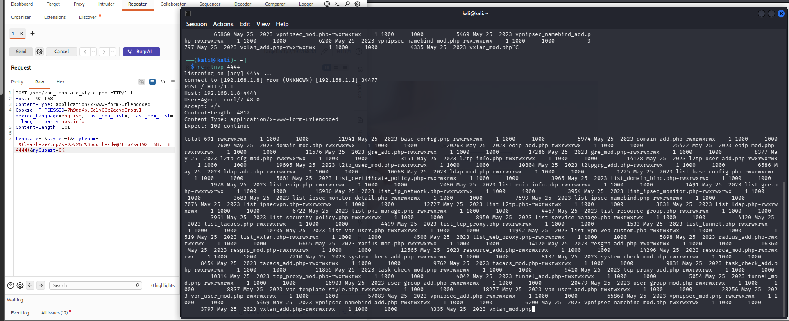
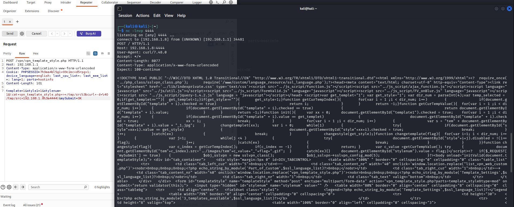
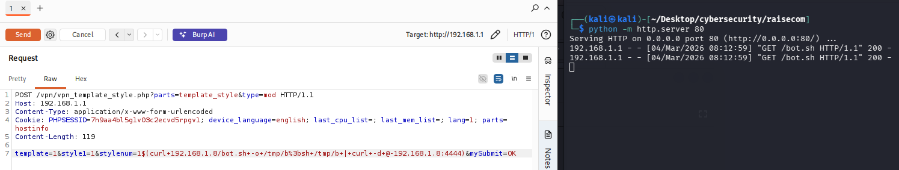
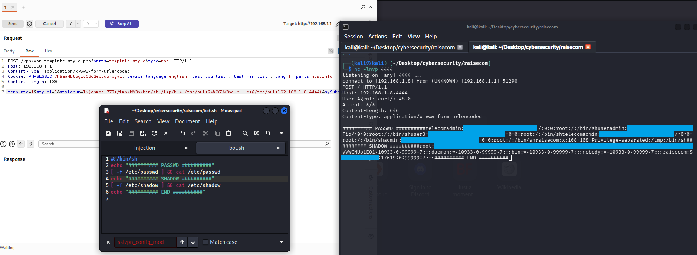
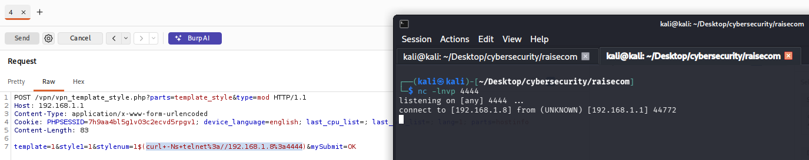

# Raisecom Gateway PoC

### High-level overview:
The vulnerability allows an unauthenticated remote attacker to execute arbitrary OS commands on the affected device with root privileges. This is achieved through an unsanitized input field in the VPN configuration module.
---

### Extended Impact & Threats:
Persistent Malware Injection: Attackers can inject and execute malicious .sh scripts (e.g., bot.sh) to gain a permanent foothold, potentially integrating the device into botnets (like Mirai) for large-scale DDoS attacks.
Service Disruption (DoS): Root access allows for total denial of service by terminating critical system processes, flushing firewall rules, or executing resource-exhaustion scripts.
Data Exfiltration & Sniffing: Successful exploitation leads to full system compromise, allowing attackers to exfiltrate sensitive files (e.g., /etc/shadow), intercept network traffic (MitM), and use the device as a pivot for lateral movement within the internal network.
Credential Risk Assessment: The exfiltrated /etc/passwd and /etc/shadow files contain password hashes using MD5 and SHA-512 (crypt) algorithms. These hashes are susceptible to offline brute-force and dictionary attacks using industry-standard tools such as John the Ripper or Hashcat, leading to the recovery of plain-text administrative credentials and persistent unauthorized access.
---

### Exact product and version:

  

- Firmware Version: Buildroot 2015.08.1 (Custom Linux Kernel 3.18.21) 
- Build Date: May 25, 2023, 16:36:18 CST  
- Kernel: Linux version 3.18.21  
- Compiler: GCC 4.6.3 (zengyan@ubuntu14-hgu)  

---

### Root Cause Analysis:
The PHP script vpn_template_style.php fails to properly sanitize the stylenum POST parameter. The application uses this input to construct a system command without sufficient filtering of shell metacharacters.
---
### Code Flow:
1. The user sends an HTTP POST request to /vpn_template_style.php.
2. The parameter stylenum is captured by the PHP backend.
3. The input is passed to a shell execution function (e.g., exec(), system(), or backticks) to process template styles.
4. By using shell metacharacters like $() or ;, an attacker can break out of the intended command context and execute arbitrary code.
---

### Suggested Fix:
Implement strict input validation to allow only alphanumeric characters for the stylenum parameter. Additionally, avoid using shell-executing functions; if necessary, use escapeshellarg() to sanitize all user-supplied inputs.
---

### ⭐ Proof-of-Concept ⭐:
Unauthenticated file disclosure

Arbitrary file write to anything

Sending script file to /tmp

Run arbitrary script file inside the router

Telnet connection

Breaking hash with john

---

